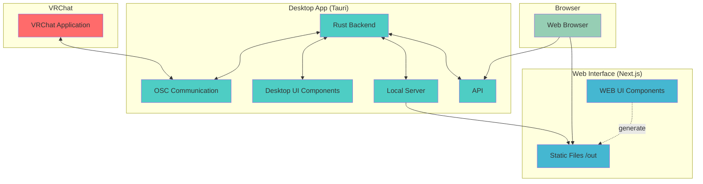

# VRC Browser Chat

## Project Overview

VRC Browser Chat is an application that enables chat communication between VRChat and a web browser. It uses the OSC (Open Sound Control) protocol to communicate with VRChat and provides a modern web interface.

**Platform Support**: This application currently supports Windows only.

## Architecture

This project consists of two main components:

### 1. Desktop Server (Tauri) - `/server`

- **Tech Stack**: Rust + Tauri + React + TypeScript  
- **Role**: Handles OSC communication with VRChat and functions as a local server  
- **Frameworks**: Tauri 2.x, React 18, Vite  
- **Build**: Bundles static files from `/web/out/` to generate a desktop app  

### 2. Web Interface (Next.js) - `/web`

- **Tech Stack**: Next.js + React + TypeScript + Tailwind CSS  
- **Role**: Web interface for chatting  
- **Frameworks**: Next.js 15.3, React 19  
- **Output**: Generates static files via Static Site Generation (SSG) in the `/out/` directory  

## Development Environment Setup

### Required Environments

- Node.js v22.14.0+ (Recommended: latest LTS version)  
- Rust 1.87.0+ (For Tauri build)  
- pnpm (Package manager)  

### Development Commands

#### Root Project Commands

```bash
pnpm install # Install all dependencies for workspace
pnpm release # Create semantic release
```

#### Server (Tauri) Development

```bash
cd server
pnpm tauri dev # Launch dev mode
```

> **Note**: The server (Tauri) app references static files built by the Web interface (`web/out/` directory). For production builds, build the Web app first, then build the Tauri app.

#### Web Interface Development

```bash
cd web
pnpm install
pnpm dev # Start dev server
pnpm build # Production build (outputs static files to the out directory)
pnpm lint # Run ESLint check
```

### Production Build

This project is built using the following steps:

1. **Build Web App Statically**

```bash
cd web
pnpm build
```

Next.js app outputs static files into the `out/` directory.

2. **Build Tauri App**

```bash
cd server
pnpm tauri build
```

Tauri bundles the static files from `web/out/` into the desktop app.

## Project Structure

```text
vrc-browser-chat/
├── .commitlintrc.json # Commitlint configuration
├── .editorconfig # Editor configuration
├── .husky/ # Git hooks configuration
│   ├── pre-commit # Pre-commit hook (runs lint-staged)
│   └── commit-msg # Commit message hook (runs commitlint)
├── .releaserc.json # Semantic-release configuration
├── package.json # Root package.json with dev dependencies and lint-staged config
├── pnpm-workspace.yaml # pnpm workspace configuration
├── server/ # Tauri desktop app
│   ├── src-tauri/ # Rust backend
│   │   ├── src/
│   │   │   ├── main.rs # Main entry point
│   │   │   ├── osc.rs # OSC communication logic
│   │   │   └── utils.rs # Utility functions
│   │   └── tauri.conf.json # Tauri configuration
│   └── src/ # React frontend
│       ├── components/ # UI components
│       └── lib/ # Utilities and commands
└── web/ # Next.js web app
    ├── src/
    │   ├── app/ # App Router
    │   ├── components/ # UI components
    │   └── lib/ # Utilities
    ├── public/ # Static assets
    └── out/ # Build output (used by Tauri)
```

## Key Features

- 🚀 **Real-time Communication**: OSC protocol for VRChat communication
- 📱 **Multi-device Support**: Access from PC, mobile, and tablets
- 💾 **Chat History**: Save and manage message history
- 🎨 **Modern UI**: Intuitive interface with dark theme support
- ⚡ **High Performance**: Lightweight and fast Rust + React app  

## Development Notes

- Server and Web Interface can be developed independently  
- OSC settings must match VRChat's configuration  
- Building the Tauri app may require system-specific setup  
- Commit messages must follow Conventional Commits format for semantic-release to work
- Git hooks automatically run linting and formatting on commit (husky + lint-staged)
- The server (Tauri) app references static files from `web/out/` directory
- For production builds: build Web app first, then Tauri app  

## Code Quality & Release Management

### Git Hooks (Husky + Lint-Staged)

This project uses husky and lint-staged to enforce code quality:

- **Pre-commit**: Automatically runs ESLint and Prettier on staged files
- **Commit-msg**: Validates commit messages against Conventional Commits format
- **Configuration**: Located in `.husky/` directory and `package.json`

### Automated Releases (Semantic Release)

This project uses semantic-release for automated versioning and releases:

- **Commit Format**: Follow [Conventional Commits](https://www.conventionalcommits.org/) specification
- **Automatic Releases**: Releases are triggered on the `main` branch via GitHub Actions
- **Version Management**: Versions are automatically determined based on commit messages
- **Changelog**: Automatically generated and updated with each release

## Branch Strategy

- `main` branch: Stable production version
- `feature/` branches: For new feature development

## Quick Start Guide

### System Requirements

- **OS**: Windows 10/11
- **VRChat**: OSC functionality enabled
- **Network**: Local network connection

### Installation & Setup

1. Download the latest version from [releases page](https://github.com/kanaru0928/vrc-browser-chat/releases)
2. Enable OSC in VRChat avatar menu
3. Launch VRC Browser Chat
4. Click "Start" in OSC section (after VRChat is running)
5. Access the WebServer URL (e.g., `http://192.168.0.1:11087`)
6. Start chatting from your browser!

## Architecture Diagram



## Contributing

We welcome pull requests and issue reports! See [CONTRIBUTING.md](docs/CONTRIBUTING.md) for detailed developer information.

## License

This project is licensed under [GPL-3.0](LICENSE).

## Support

- 🐛 Bug reports & 💡 Feature requests: [Issues](https://github.com/kanaru0928/vrc-browser-chat/issues)

---

Made with ❤️ for VRChat community

## Troubleshooting

- If Tauri build errors occur, check your Rust environment  
- If OSC communication doesn’t work, verify port and VRChat settings  
- If ESLint errors appear in Next.js, run `pnpm lint` to check details  
