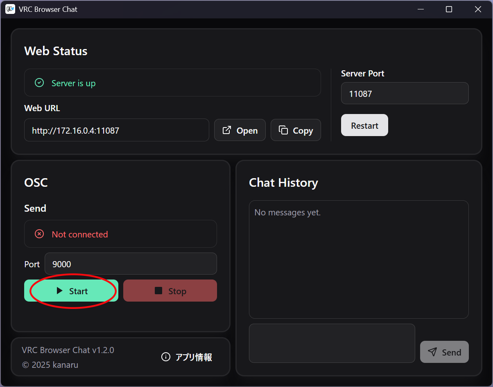
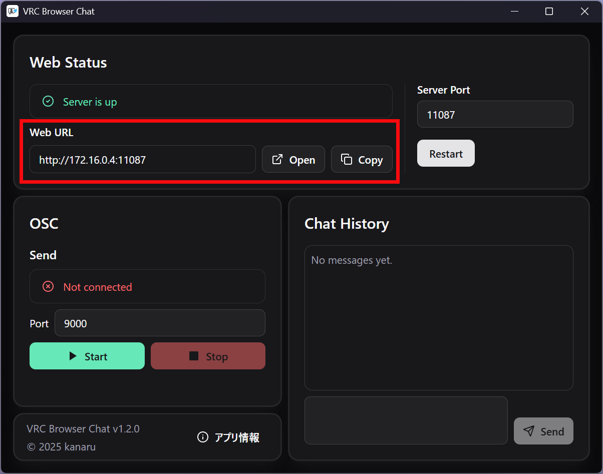

# VRC Browser Chat

_[English](README_EN.md) | 日本語_

VRChat でのチャットを Web ブラウザから送信できるモダンなアプリケーションです。

## ✨ 特徴

- 🚀 **リアルタイム通信**: OSC プロトコルによる VRChat との通信
- 📱 **マルチデバイス対応**: PC、スマホ、タブレットからアクセス可能
- 💾 **チャット履歴**: 送信履歴の保存・管理機能
- 🎨 **モダン UI**: ダークテーマ対応の直感的なインターフェース
- ⚡ **高パフォーマンス**: Rust + React 製の軽量・高速アプリ

## 📋 システム要件

- **OS**: Windows 10/11
- **VRChat**: OSC 機能が有効化されていること
- **ネットワーク**: ローカルネットワーク接続

## 🚀 クイックスタート

### 1. インストール

最新版を[リリースページ](https://github.com/kanaru0928/vrc-browser-chat/releases)からダウンロードしてインストールしてください。

### 2. VRChat の設定

1. VRChat を起動
2. アバターメニューから「OSC」を有効化

### 3. アプリの起動

1. VRC Browser Chat を起動
2. **OSC セクション**の「Start」ボタンをクリック

   

   > ⚠️ VRChat 起動後に Start してください

3. **WebServer セクション**の URL にアクセス
   - 例: `http://192.168.0.1:11087`
   - 「Open」ボタンで自動的にブラウザが開きます

   

### 4. チャット開始

ブラウザからメッセージを入力して VRChat に送信できます！

## 🤝 コントリビューション

プルリクエストやイシューの報告を歓迎します！開発者向けの詳細情報は[CONTRIBUTING.md](docs/CONTRIBUTING.md)をご確認ください。

## 📄 ライセンス

このプロジェクトは[GPL-3.0](LICENSE)の下で公開されています。

## 🙋‍♂️ サポート

- 🐛 バグ報告・💡 機能要望: [Issues](https://github.com/kanaru0928/vrc-browser-chat/issues)

---

Made with ❤️ for VRChat community
