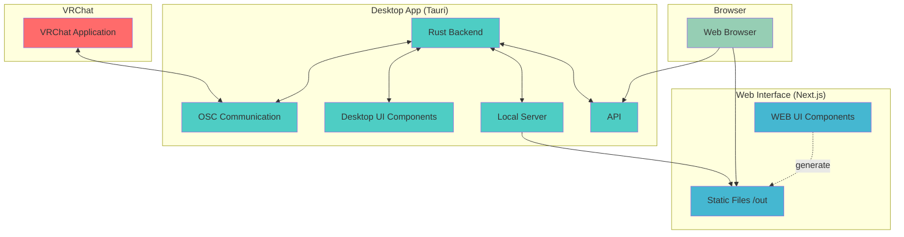

# コントリビューション・ガイド

VRC Browser Chat プロジェクトへのコントリビューションありがとうございます！このガイドでは、プロジェクトに貢献する方法について説明します。

## 開発環境のセットアップ

### 必要な環境

- Node.js v22.14.0+（推奨：最新 LTS 版）
- Rust 1.87.0+（Tauri ビルド用）
- pnpm（パッケージマネージャー）

### 初期設定

1. リポジトリをクローンします：

   ```bash
   git clone https://github.com/your-username/vrc-browser-chat.git
   cd vrc-browser-chat
   ```

1. 依存関係をインストールします：

   ```bash
   pnpm install
   ```

1. 開発サーバーを起動します：

#### サーバー（Tauri）の場合

```bash
cd server
pnpm tauri dev
```

> **注意**: サーバー（Tauri）アプリは、Web インターフェースでビルドされた静的ファイル（`web/out/` ディレクトリ）を参照します。本番ビルド時は、まず Web アプリをビルドしてから Tauri アプリをビルドする必要があります。

#### Web インターフェースの場合

```bash
cd web
pnpm dev
```

## 開発ワークフロー

### ブランチ戦略

- `main` ブランチ：本番用の安定版
- `feature/` ブランチ：新機能開発用

### コミットメッセージ

このプロジェクトでは [Conventional Commits](https://www.conventionalcommits.org/) 形式を使用しています：

```plaintext
<type>[optional scope]: <description>

[optional body]

[optional footer(s)]
```

**タイプの例：**

- `feat`: 新機能
- `fix`: バグ修正
- `docs`: ドキュメントの変更
- `style`: コードの意味に影響しない変更（フォーマット、セミコロンの追加等）
- `refactor`: バグ修正や機能追加ではないコードの変更
- `test`: テストの追加や修正
- `chore`: ビルドプロセスや補助ツールの変更

**例：**

```bash
feat(chat): add message history feature
fix(osc): resolve connection timeout issue
docs: update README with installation guide
```

### コード品質

プロジェクトでは以下のツールを使用してコード品質を保っています：

- **ESLint**: JavaScript/TypeScript の静的解析
- **Prettier**: コードフォーマッター
- **Husky**: Git フック管理
- **lint-staged**: ステージされたファイルのみ lint 実行

コミット前に自動的に lint と format が実行されます。

## プルリクエストのガイドライン

1. **ブランチを作成する**

   ```bash
   git checkout -b feature/your-feature-name
   ```

2. **変更を加える**

   - コミットメッセージは Conventional Commits 形式に従う

3. **プルリクエストを作成する**
   - 変更内容を分かりやすく説明する
   - 関連する Issue があれば言及する
   - スクリーンショットがあれば添付する

## Issue の報告

バグを発見した場合や新機能を提案したい場合は、Issue を作成してください：

1. 既存の Issue を確認し、重複がないかチェック
2. 適切なテンプレートを使用
3. 再現手順や期待する動作を明確に記述
4. 可能であればスクリーンショットやログを添付

## プロジェクト構造

```plaintext
vrc-browser-chat/
├── server/          # Tauri デスクトップアプリ
│   ├── src-tauri/   # Rust バックエンド
│   └── src/         # React フロントエンド
└── web/             # Next.js Web アプリ
    ├── src/
    ├── public/
    └── out/         # ビルド出力（Tauri で使用）
```

## 技術スタック

### アーキテクチャ構成図



### サーバー（Tauri）

- Rust + Tauri 2.x
- React 18 + TypeScript
- Vite

### Web インターフェース

- Next.js 15.3 + React 19
- TypeScript
- Tailwind CSS

**重要**: サーバー（Tauri）アプリは、Web インターフェースでビルドされた静的ファイル（`web/out/` ディレクトリ）を参照します。本番ビルド時は、まず Web アプリをビルドしてから Tauri アプリをビルドする必要があります。

## ローカルビルド

### Web アプリのビルド

```bash
cd web
pnpm build
```

静的ファイルが `web/out/` ディレクトリに出力されます。

### Tauri アプリのビルド

```bash
cd server
pnpm tauri build
```

ビルドされた実行ファイルは `server/src-tauri/target/release/bundle/` ディレクトリに作成されます。

## リリースプロセス

このプロジェクトでは semantic-release を使用した自動リリースを行っています：

- `main` ブランチへのマージ時に自動的にリリースが実行
- バージョンはコミットメッセージに基づいて自動決定
- Changelog も自動生成

## サポート

質問がある場合は：

1. まず既存の Issue やドキュメントを確認
2. Discussion は使用しない
3. バグ報告は Issue を作成

## ライセンス

コントリビューションを行うことで、あなたの貢献がプロジェクトのライセンスの下で配布されることに同意したものとします。

---

コントリビューションをお待ちしています！ 🎉
