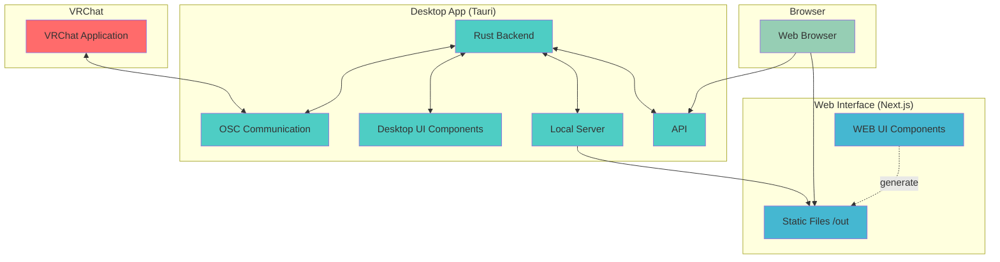

# Contributing Guide

Thank you for contributing to the VRC Browser Chat project! This guide explains how to contribute to the project.

## Development Environment Setup

### Requirements

- Node.js v22.14.0+ (Recommended: Latest LTS version)
- Rust 1.87.0+ (For Tauri build)
- pnpm (Package manager)

### Initial Setup

1. Clone the repository:

   ```bash
   git clone https://github.com/your-username/vrc-browser-chat.git
   cd vrc-browser-chat
   ```

2. Install dependencies:

   ```bash
   pnpm install
   ```

3. Start the development server:

#### For Server (Tauri)

```bash
cd server
pnpm tauri dev
```

> **Note**: The server (Tauri) app references static files built by the Web interface (`web/out/` directory). For production builds, you must first build the Web app, then build the Tauri app.

#### For Web Interface

```bash
cd web
pnpm dev
```

## Development Workflow

### Branch Strategy

- `main` branch: Stable version for production
- `feature/` branch: For new feature development

### Commit Messages

This project uses [Conventional Commits](https://www.conventionalcommits.org/) format:

```plaintext
<type>[optional scope]: <description>

[optional body]

[optional footer(s)]
```

**Type examples:**

- `feat`: New features
- `fix`: Bug fixes
- `docs`: Documentation changes
- `style`: Changes that don't affect the meaning of the code (formatting, semicolons, etc.)
- `refactor`: Code changes that neither fix bugs nor add features
- `test`: Adding or modifying tests
- `chore`: Changes to build process or auxiliary tools

**Examples:**

```bash
feat(chat): add message history feature
fix(osc): resolve connection timeout issue
docs: update README with installation guide
```

### Code Quality

The project uses the following tools to maintain code quality:

- **ESLint**: Static analysis for JavaScript/TypeScript
- **Prettier**: Code formatter
- **Husky**: Git hooks management
- **lint-staged**: Run lint only on staged files

Lint and format are automatically executed before commits.

## Pull Request Guidelines

1. **Create a branch**

   ```bash
   git checkout -b feature/your-feature-name
   ```

2. **Make changes**

   - Follow Conventional Commits format for commit messages

3. **Create a pull request**
   - Clearly describe the changes
   - Reference related issues if any
   - Attach screenshots if applicable

## Issue Reporting

When you find bugs or want to propose new features, please create an Issue:

1. Check existing Issues to avoid duplicates
2. Use appropriate templates
3. Clearly describe reproduction steps and expected behavior
4. Attach screenshots or logs if possible

## Project Structure

```plaintext
vrc-browser-chat/
├── server/          # Tauri desktop app
│   ├── src-tauri/   # Rust backend
│   └── src/         # React frontend
└── web/             # Next.js web app
    ├── src/
    ├── public/
    └── out/         # Build output (used by Tauri)
```

## Tech Stack

### Architecture Diagram



### Server (Tauri)

- Rust + Tauri 2.x
- React 18 + TypeScript
- Vite

### Web Interface

- Next.js 15.3 + React 19
- TypeScript
- Tailwind CSS

**Important**: The server (Tauri) app references static files built by the Web interface (`web/out/` directory). For production builds, you must first build the Web app, then build the Tauri app.

## Local Build

### Building the Web App

```bash
cd web
pnpm build
```

Static files will be output to the `web/out/` directory.

### Building the Tauri App

```bash
cd server
pnpm tauri build
```

The built executable will be created in the `server/src-tauri/target/release/bundle/` directory.

## Release Process

This project uses semantic-release for automated releases:

- Releases are automatically triggered when merging to the `main` branch
- Versions are automatically determined based on commit messages
- Changelog is also automatically generated

## Support

If you have questions:

1. First check existing Issues and documentation
2. Do not use Discussions
3. Create an Issue for bug reports

## License

By contributing, you agree that your contributions will be distributed under the project's license.

---

We look forward to your contributions! 🎉
